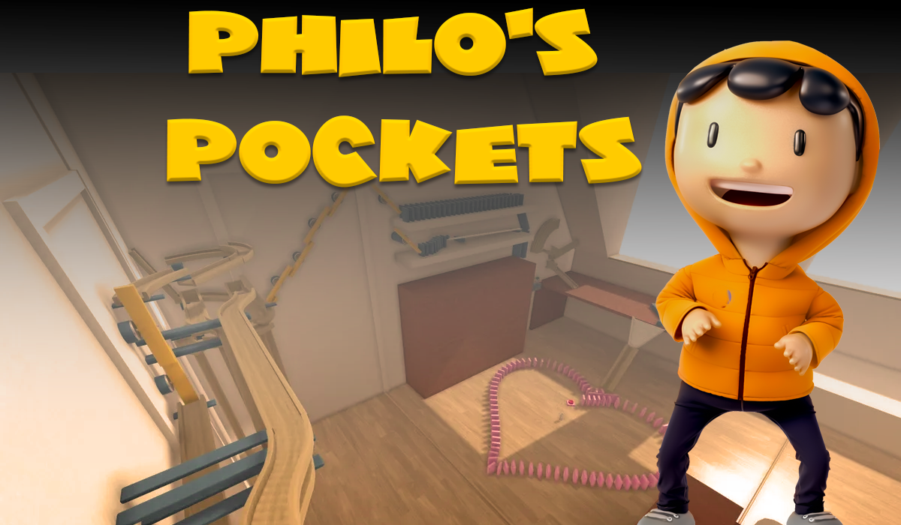

# Philos Pockets

NFT Virtual World Escape Room Game, Creator Platform and Marketplace with support for User Generated Content Creation and Ownership

## Videos

Two Minute intro
- [Philos Pockets 2 Minute Intro](https://youtu.be/rxghuU5GvVA)

In depth 10 minute video
- [Philos Pockets In depth Description](https://youtu.be/psymGSzL2b4)

## Instructions/Walkthrough Video of Hyperverse Hackathon Submission
- [Philos Pockets Instructions - walkthrough](https://youtu.be/wSU82b5bOGU)

## Launching the project Instructions
1. `clone https://github.com/acylum/PhilosPockets.git` - enter a folder where you want to clone to. 
2. `npm install` - sets up all dependancies
3. `yarn install` - sets up more dependancies (make sure thst you have 'yarn' on your computer)
4. `pnpm storybook` - open your browser to http://localhost:6006/

## NextJS Version
This version shows the Nextjs Marketplace
1. `clone https://github.com/acylum/Philos-Pockets-NextJs.git` - enter a folder where you want to clone to. 
2. `npm install` - sets up all dependancies
3. `yarn install` - sets up more dependancies (make sure thst you have 'yarn' on your computer)
4. `pnpm storybook` - open your browser to http://localhost:6006/

## Team Members
`Nacho Money`

Discord: `NachoMoney#4976`
Twitter: `@nachomoneyhoney`